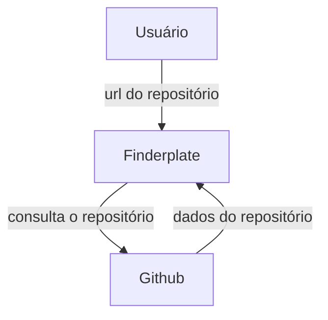

# finderplate

## O que é?
Finderplate é uma api criada para facilitar a busca por templates de projetos de código. Com essa api você poderá encontrar e cadastrar templates utilizando apenas a url.
Dessa forma, você poderá rapidamente começar seu projeto.

## Como funciona?


## Como usar?

1. clone o repositório
2. acesse o repositório local
    ``` shell
    cd finderplate/
    ```
3. instale todas as dependências
    ``` shell
    npm i
    ```
4. execute o projeto
    ``` shell
    npm run dev
    ```
